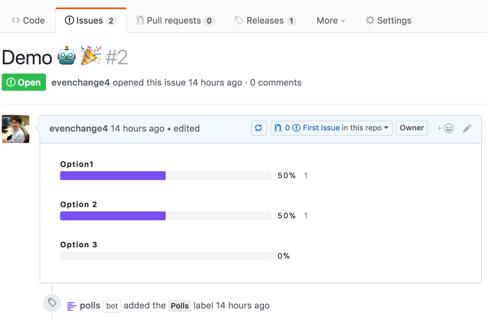

Should this repository be archived as it [hasn't worked for several months](https://github.com/evenchange4/gh-polls-bot/issues/26)?

[](https://api.gh-polls.com/poll/01FM67RZ088FX9RKCVSWQR5VG7/Yes/vote)
[](https://api.gh-polls.com/poll/01FM67RZ088FX9RKCVSWQR5VG7/No/vote)

<hr/>

# Obsolete content

<hr/>

<p align="center" >
  <a href="https://github.com/apps/polls">
    
  </a>
</p>

# GitHub Polls Bot

> A GitHub App built with [Probot](https://github.com/probot/probot) that automatically creates [gh-polls](https://github.com/apex/gh-polls) in GitHub issues.

[![Travis][travis-badge]][travis]
[![Codecov Status][codecov-badge]][codecov]
[![Dependency Status][dependency-badge]][dependency]
[![devDependency Status][devDependency-badge]][devDependency]
[![peerDependency Status][peerDependency-badge]][peerDependency]
[![Greenkeeper badge][greenkeeper-badge]][greenkeeper]
[![prettier][prettier-badge]][prettier]
[![license][license-badge]][license]

## Usage

1. Configure the GitHub App: [github.com/apps/polls](https://github.com/apps/polls)
2. Add command to issue:

```md
/polls Option1 'Option 2' "Option 3"

# Automatically replace with the following markdown =>
[](https://api.gh-polls.com/poll/01BY7ECS60GG8F9AR1VMR8745S/Option1/vote)
[](https://api.gh-polls.com/poll/01BY7ECS60GG8F9AR1VMR8745S/Option%202/vote)
[](https://api.gh-polls.com/poll/01BY7ECS60GG8F9AR1VMR8745S/Option%203/vote)
```

| **Screenshot** | [](https://github.com/evenchange4/gh-polls-bot/issues/2)  |
| -------------- | -------- |
| **Demo** |  |

## Developer Guide

### Environments

- Create a `.env` file from `.env.example`.
- Download the `private-key.pem` from GitHub and move it to your project’s directory.

> Note: Please follow the [Developing an App](https://probot.github.io/docs/development/) section of Probot documents.

### Requirements

-   node >= 9.0.0
-   yarn >= 1.3.2

```
$ git clone https://github.com/evenchange4/gh-polls-bot
$ yarn install --pure-lockfile

$ yarn run dev # dev server
$ yarn start   # prod server
```

### Test

```
$ yarn run format
$ yarn run eslint
$ yarn run test:watch
$ yarn run flow
$ yarn run flow-coverage
```

### Deploy to Now.sh

Any git commits push to master branch.

```cmd
$ npm version patch
$ yarn run changelog
```

> Note: PRIVATE_KEY pem workaround: [first-timers-bot #89](https://github.com/hoodiehq/first-timers-bot/pull/89)

### Technology Stacks

- [Create-Probot-App](https://github.com/probot/create-probot-app)
- Travis - CI
- [Zeit Now.sh](https://zeit.co/now)

## Inspiration

- https://github.com/probot/commands
- https://github.com/srph/gh-polls-web

## Misc

- Redirect to github.com for private repos. [\[apex/gh-polls#3\]](https://github.com/apex/gh-polls/issues/3#issuecomment-312964372)
- PEM format doesn't play nicely with now.sh secrets/env vars. [\[probot/friction#17\]](https://github.com/probot/friction/issues/17)
- Links related to GH polls:
  - [Web App](https://app.gh-polls.com/) – GH polls web app
  - [apex/gh-polls](https://github.com/apex/gh-polls) – Polls for user feedback in GitHub issues [gh-polls.com](https://gh-polls.com/)
  - [bukinoshita/gh-polls](https://github.com/bukinoshita/gh-polls) – node module to create gh-polls

## CONTRIBUTING

*   ⇄ Pull requests and ★ Stars are always welcome.
*   For bugs and feature requests, please create an issue.
*   Pull requests must be accompanied by passing automated tests (`$ yarn run test`).

## [CHANGELOG](CHANGELOG.md)

## [LICENSE](LICENSE)

MIT: [http://michaelhsu.mit-license.org](http://michaelhsu.mit-license.org)

[travis-badge]: https://img.shields.io/travis/evenchange4/gh-polls-bot/master.svg?style=flat-square
[travis]: https://travis-ci.org/evenchange4/gh-polls-bot
[codecov-badge]: https://img.shields.io/codecov/c/github/evenchange4/gh-polls-bot.svg?style=flat-square
[codecov]: https://codecov.io/github/evenchange4/gh-polls-bot?branch=master
[dependency-badge]: https://david-dm.org/evenchange4/gh-polls-bot.svg?style=flat-square
[dependency]: https://david-dm.org/evenchange4/gh-polls-bot
[devDependency-badge]: https://david-dm.org/evenchange4/gh-polls-bot/dev-status.svg?style=flat-square
[devDependency]: https://david-dm.org/evenchange4/gh-polls-bot#info=devDependencies
[peerDependency-badge]: https://david-dm.org/evenchange4/gh-polls-bot/peer-status.svg?style=flat-square
[peerDependency]: https://david-dm.org/evenchange4/gh-polls-bot#info=peerDependencies
[license-badge]: https://img.shields.io/github/license/evenchange4/gh-polls-bot.svg?style=flat-square
[license]: http://michaelhsu.mit-license.org/
[greenkeeper-badge]: https://badges.greenkeeper.io/evenchange4/gh-polls-bot.svg
[greenkeeper]: https://greenkeeper.io/
[prettier-badge]: https://img.shields.io/badge/styled_with-prettier-ff69b4.svg?style=flat-square
[prettier]: https://github.com/prettier/prettier
